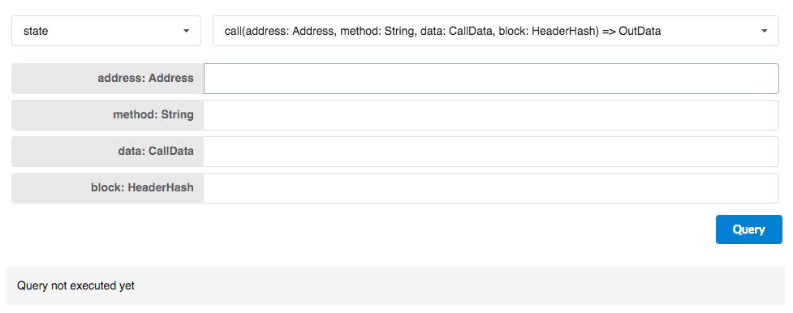



- [@polkadot/app-rpc](https://github.com/polkadot-js/app-rpc) An application to perform any RPC query on a running node. It exposes the list of available methods on the RPC layer and allows the user to enter any parameters. 
